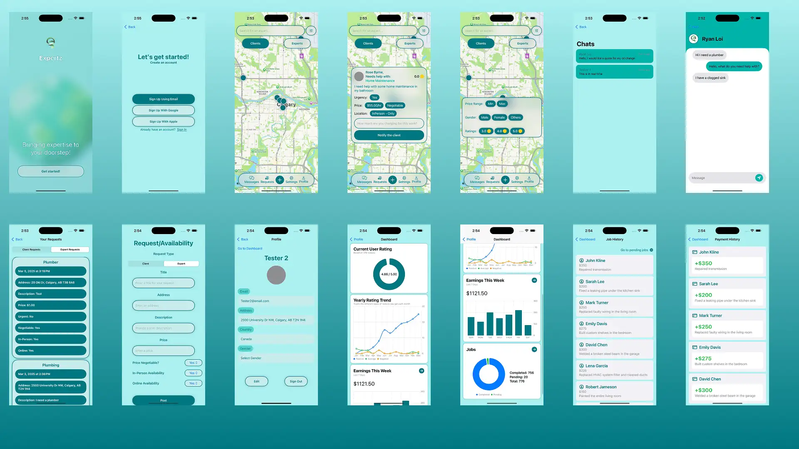

<a id="readme-top"></a>

<div align="center">
  <a href="https://github.com/michelle-loi/Expertz">
    
  </a>

  <h3 align="center">Expertz</h3>
  <p align="left">
   Expertz is a convenient freelancing platform designed to connect clients with trusted experts for a wide range of services, from home maintenance to skill development. Unlike traditional platforms, Expertz focuses on aligning client needs and expert expectations by offering flexible pricing, fast service, and reliable reviews.
  </p>
  <a href="https://github.com/michelle-loi/Expertz"><strong>Explore the docs »</strong></a>
  <br/>
  <br/>
  <p>
   
   
   
  </p>
</div>

## About The Project



### Platforms

[![iOS][iOS]][iOS-url]

### Built With

[![Swift][Swift]][Swift-url]
[![Firebase][Firebase]][Firebase-url]

<p align="right">(<a href="#readme-top">back to top</a>)</p>

## Introduction

This application demonstrates the integration of Firebase services with a SwiftUI app. It includes user authentication, Firestore database interactions, and real-time messaging capabilities.

<p align="right">(<a href="#readme-top">back to top</a>)</p>

## Features

- **User Authentication**: Sign up and login functionality using Firebase Authentication.
- **User Profiles**: Create and manage user profiles stored in Firestore.
- **Client and Expert Requests**: Users can create and view service requests.
- **Real-time Chat**: Basic chat functionality using Firestore.
- **Expert Dashboard**: View job and payment statistics, along with job history.
- **Map Functionality**: View job requests on the built-in map.

<p align="right">(<a href="#readme-top">back to top</a>)</p>

## Installation and Setup

1. **Clone the repository**:

```bash
git clone https://github.com/michelle-loi/Expertz
```

2. **Open the Project in Xcode**:

3. **Dependencies**:
   - All necessary dependencies are included in the project.
   - The `GoogleService-Info.plist` file is not included (this file is configured to connect to our team's Firebase backend).
   - No additional setup is required.

<p align="right">(<a href="#readme-top">back to top</a>)</p>

## Running the Application

1. **Build and Run**:

   - Select a simulator or a physical device in Xcode.
   - Build and run the project by clicking on the **Run** button or pressing `⌘ + R`.

2. **Permissions**:

   - Ensure the application has internet access to interact with Firebase services.

<p align="right">(<a href="#readme-top">back to top</a>)</p>

## Authentication

To use the application's features, you need to be authenticated.

### Option 1: Create a New Account

- **Sign Up**:

  - Launch the app.
  - Click on the **Sign Up Using Email** button.
  - Fill in the required information to create a new account.

### Option 2: Use Test Credentials

- Launch the app.
- Click on the **Sign In** button.
- Fill in the required information to log in.

- **Email**: `micheal@expert.com` (for expert account) or `c1@clients.com` (for client account)
- **Password**: `123456` (for both accounts)

_Note: If you encounter any issues logging in with the test credentials, please use the Sign Up option to create a new account._

<p align="right">(<a href="#readme-top">back to top</a>)</p>

## Firebase Security Rules

For the purpose of this evaluation, the Firebase security rules are configured to allow authenticated users to interact with the database. The rules ensure:

- **User Authentication**: Only authenticated users can read and write data.
- **Data Privacy**: Users can access their own profiles and create requests.

<p align="right">(<a href="#readme-top">back to top</a>)</p>

## App Icon

An app icon is included in the project and is properly configured in the asset catalog.

<p align="right">(<a href="#readme-top">back to top</a>)</p>

## Notes

- **Data Privacy**:

  - No sensitive personal data is stored within the database.

- **Testing Considerations**:

  - Feel free to create, read, update, and delete data within the app to evaluate its functionality.

<p align="right">(<a href="#readme-top">back to top</a>)</p>

## Contact Information

- https://github.com/michelle-loi
- https://github.com/TheAlanHuynh
- https://github.com/RyanLoi98
- https://github.com/Joshanide
- https://github.com/areza244

<p align="right">(<a href="#readme-top">back to top</a>)</p>

---

**Disclaimer**: This project was created for academic evaluation by Dr. Christian Jacob at the University of Calgary. Unauthorized use, distribution, or reproduction of this project or its components is prohibited.

<p align="right">(<a href="#readme-top">back to top</a>)</p>

<!-- Links -->

[iOS]: https://img.shields.io/badge/iOS-000000?style=for-the-badge&logo=apple&logoColor=white
[iOS-url]: https://www.apple.com/ca/ios/
[Firebase]: https://img.shields.io/badge/firebase-FFCA28?style=for-the-badge&logo=firebase&logoColor=black
[Firebase-url]: https://firebase.google.com/
[Swift]: https://img.shields.io/badge/swift-FA7343?style=for-the-badge&logo=swift&logoColor=white
[Swift-url]: https://swift.org/
